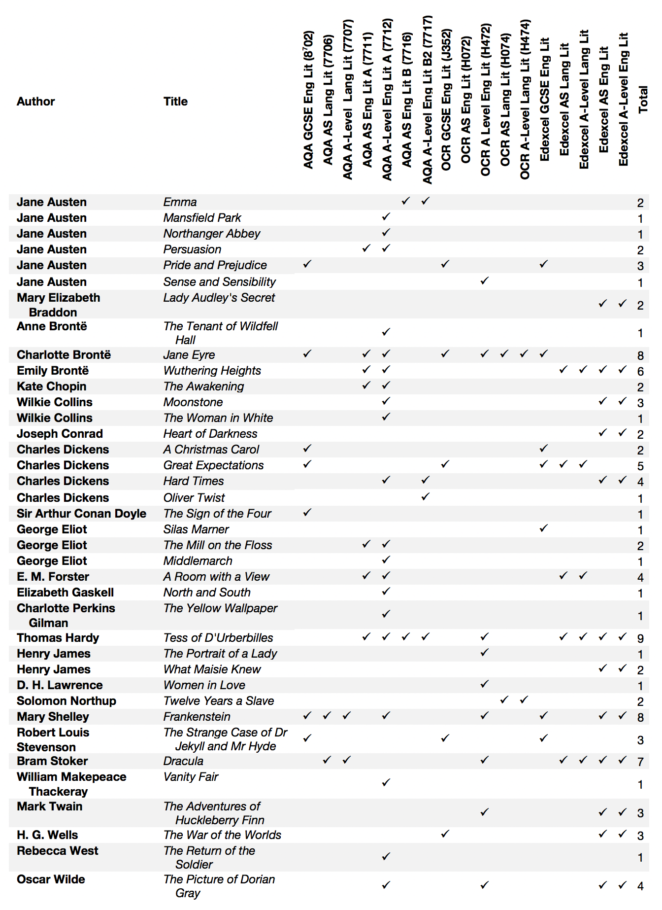

Appendices
==========

The appendices only act as an overview. For up-to-date information and the documentation of how the corpus texts were cleaned, please refer to the README in the [GitHub_corpora]_ repository. You can also create a dynamic list of the books in the corpora (and their word counts) using the :ref:`Counts` tab.

.. rubric:: A list of texts available in CLiC
   :name: a-list-of-texts-available-in-clic

**Pre-selected corpora in CLiC**

-  DNov (15 texts) = Dickens's Novels
-  ChiLit (71 texts) = 19th Century Children's Literature Corpus
-  19C (29 texts) = 19th Century Reference Corpus
-  ArTs (23 texts) = Additional Requested Texts (containing more set
   titles from A-Level and GCSE exam specifications)

.. rubric:: Titles in the DNov, 19C and ArTs pre-selected corpora
   :name: titles-in-the-dnov-19c-and-arts-pre-selected-corpora

+-----------------------------------+-----------------------------------+
| Title                             | Author                            |
+===================================+===================================+
| Vice Versa; or, A Lesson to       | F. Anstey                         |
| Fathers                           |                                   |
+-----------------------------------+-----------------------------------+
| The Brass Bottle                  | F. Anstey                         |
+-----------------------------------+-----------------------------------+
| The Coral Island: A Tale of the   | R. M. Ballantyne                  |
| Pacic Ocean                       |                                   |
+-----------------------------------+-----------------------------------+
| Peter Pan                         | J. M. Barrie                      |
+-----------------------------------+-----------------------------------+
| The Secret Garden                 | Frances Hodgson Burnett           |
+-----------------------------------+-----------------------------------+
| Alice's Adventures in Wonderland  | Lewis Carroll                     |
+-----------------------------------+-----------------------------------+
| Through the Looking-Glass         | Lewis Carroll                     |
+-----------------------------------+-----------------------------------+
| The Surprising Adventures of Sir  | S.R. Crockett                     |
| Toady Lion with Those of General  |                                   |
| Napoleon Smith                    |                                   |
+-----------------------------------+-----------------------------------+
| Mrs. Overtheway's Remembrances    | Juliana Horatia Ewing             |
+-----------------------------------+-----------------------------------+
| Jackanapes                        | Juliana Horatia Ewing             |
+-----------------------------------+-----------------------------------+
| Moonfleet                         | J. Meade Falkner                  |
+-----------------------------------+-----------------------------------+
| Eric; Or, Little by Little        | F. W. Farrar                      |
+-----------------------------------+-----------------------------------+
| Adventures in Wallypug-Land       | G. E. Farrow                      |
+-----------------------------------+-----------------------------------+
| The Golden Age                    | Kenneth Grahame                   |
+-----------------------------------+-----------------------------------+
| Dream Days                        | Kenneth Grahame                   |
+-----------------------------------+-----------------------------------+
| The Wind in the Willows           | Kenneth Grahame                   |
+-----------------------------------+-----------------------------------+
| King Solomon's Mines              | H. Rider Haggard                  |
+-----------------------------------+-----------------------------------+
| Allan Quatermain                  | H. Rider Haggard                  |
+-----------------------------------+-----------------------------------+
| Winning His Spurs. A Tale of the  | G. A. Henty                       |
| Crusades                          |                                   |
+-----------------------------------+-----------------------------------+
| With Clive in India; Or, The      | G. A. Henty                       |
| Beginnings of an Empire           |                                   |
+-----------------------------------+-----------------------------------+
| Tom Brown's Schooldays            | Thomas Hughes                     |
+-----------------------------------+-----------------------------------+
| Mopsa the Fairy                   | Jean Ingelow                      |
+-----------------------------------+-----------------------------------+
| Wood Magic, a Fable               | Richard Jefferies                 |
+-----------------------------------+-----------------------------------+
| Madam How and Lady Why; Or, First | Charles Kingsley                  |
| Lessons in Earth Lore for         |                                   |
| Children                          |                                   |
+-----------------------------------+-----------------------------------+
| The Water-Babies                  | Charles Kingsley                  |
+-----------------------------------+-----------------------------------+
| Stalky and Co                     | Rudyard Kipling                   |
+-----------------------------------+-----------------------------------+
| The Jungle Book                   | Rudyard Kipling                   |
+-----------------------------------+-----------------------------------+
| Prince Prigio                     | Andrew Lang                       |
+-----------------------------------+-----------------------------------+
| At the Back of the North Wind     | George McDonald                   |
+-----------------------------------+-----------------------------------+
| The Princess and the Goblin       | George McDonald                   |
+-----------------------------------+-----------------------------------+
| The Three Mulla-mulgars           | Walter de la Mare                 |
+-----------------------------------+-----------------------------------+
| Masterman Ready; Or, The Wreck of | Frederick Marryat                 |
| the Pacific                       |                                   |
+-----------------------------------+-----------------------------------+
| The Settlers in Canada            | Frederick Marryat                 |
+-----------------------------------+-----------------------------------+
| The Children of the New Forest    | Frederick Marryat                 |
+-----------------------------------+-----------------------------------+
| Feats on the Fiord                | Harriet Martineau                 |
+-----------------------------------+-----------------------------------+
| The Crofton Boys                  | Harriet Martineau                 |
+-----------------------------------+-----------------------------------+
| The Peasant and the Prince        | Harriet Martineau                 |
+-----------------------------------+-----------------------------------+
| The Settlers at Home              | Harriet Martineau                 |
+-----------------------------------+-----------------------------------+
| A World of Girls: The Story of a  | L. T. Meade                       |
| School                            |                                   |
+-----------------------------------+-----------------------------------+
| The Cuckoo Clock                  | Mary Louisa Molesworth            |
+-----------------------------------+-----------------------------------+
| The Tapestry Room: A Child's      | Mary Louisa Molesworth            |
| Romance                           |                                   |
+-----------------------------------+-----------------------------------+
| The Carved Lions                  | Mary Louisa Molesworth            |
+-----------------------------------+-----------------------------------+
| The Book of Dragons               | E. Nesbit                         |
+-----------------------------------+-----------------------------------+
| The Story of the Treasure Seekers | E. Nesbit                         |
+-----------------------------------+-----------------------------------+
| Nine Unlikely Tales               | E. Nesbit                         |
+-----------------------------------+-----------------------------------+
| The Railway Children              | E. Nesbit                         |
+-----------------------------------+-----------------------------------+
| Five Children and It              | E. Nesbit                         |
+-----------------------------------+-----------------------------------+
| The Story of the Amulet           | E. Nesbit                         |
+-----------------------------------+-----------------------------------+
| The Tale of Peter Rabbit          | Beatrix Potter                    |
+-----------------------------------+-----------------------------------+
| The Tale of Squirrel Nutkin       | Beatrix Potter                    |
+-----------------------------------+-----------------------------------+
| The Tale of Benjamin Bunny        | Beatrix Potter                    |
+-----------------------------------+-----------------------------------+
| The Tale of Two Bad Mice          | Beatrix Potter                    |
+-----------------------------------+-----------------------------------+
| The Tale of Jemima Puddle-Duck    | Beatrix Potter                    |
+-----------------------------------+-----------------------------------+
| The Tale of the Flopsy Bunnies    | Beatrix Potter                    |
+-----------------------------------+-----------------------------------+
| The Fifth Form at Saint           | Talbot Baines Reed                |
| Dominic's: A School Story         |                                   |
+-----------------------------------+-----------------------------------+
| The King of the Golden River; or, | John Ruskin                       |
| the Black Brothers: A Legend of   |                                   |
| Stiria                            |                                   |
+-----------------------------------+-----------------------------------+
| Black Beauty                      | Anna Sewell                       |
+-----------------------------------+-----------------------------------+
| Holiday House: A Series of Tales  | Catherine Sinclair                |
+-----------------------------------+-----------------------------------+
| Kidnapped                         | Robert Louis Stevenson            |
+-----------------------------------+-----------------------------------+
| Treasure Island                   | Robert Louis Stevenson            |
+-----------------------------------+-----------------------------------+
| Jessica's First Prayer            | Hesba Stretton                    |
+-----------------------------------+-----------------------------------+
| Little Meg's children             | Hesba Stretton                    |
+-----------------------------------+-----------------------------------+
| Alone in London                   | Hesba Stretton                    |
+-----------------------------------+-----------------------------------+
| The Rival Crusoes; or The         | Agnes Strickland                  |
| Shipwreck                         |                                   |
+-----------------------------------+-----------------------------------+
| The Rose and the Ring             | William Makepeace Thackeray       |
+-----------------------------------+-----------------------------------+
| Leila at home                     | Ann Fraser Tytler                 |
+-----------------------------------+-----------------------------------+
| The Happy Prince, and Other       | Oscar Wilde                       |
| Tales                             |                                   |
+-----------------------------------+-----------------------------------+
| The Heir of Redclye               | Charlotte M. Yonge                |
+-----------------------------------+-----------------------------------+
| The Daisy Chain, or Aspirations   | Charlotte M. Yonge                |
+-----------------------------------+-----------------------------------+
| The Dove in the Eagle's Nest      | Charlotte M. Yonge                |
+-----------------------------------+-----------------------------------+
| The Little Duke: Richard the      | Charlotte M. Yonge                |
| Fearless                          |                                   |
+-----------------------------------+-----------------------------------+

.. rubric:: Titles in ChiLit; a corpus compiled by Anna Cermakova for
   the GLARE project
   :name: titles-in-chilit-a-corpus-compiled-by-anna-cermakova-for-the-glare-project

Also see the [GLARE_project_page]_.

+-----------------------+-----------------------+-----------------------+
| Title                 | Author                | Corpus                |
+=======================+=======================+=======================+
| Emma                  | Jane Austen           | 19C                   |
+-----------------------+-----------------------+-----------------------+
| Persuasion            | Jane Austen           | 19C                   |
+-----------------------+-----------------------+-----------------------+
| Pride and Prejudice   | Jane Austen           | 19C                   |
+-----------------------+-----------------------+-----------------------+
| Sense and Sensibility | Jane Austen           | ArTs                  |
+-----------------------+-----------------------+-----------------------+
| Mansfield Park        | Jane Austen           | ArTs                  |
+-----------------------+-----------------------+-----------------------+
| Northanger Abbey      | Jane Austen           | ArTs                  |
+-----------------------+-----------------------+-----------------------+
| Lady Susan            | Jane Austen           | ArTs                  |
+-----------------------+-----------------------+-----------------------+
| Lady Audley's Secret  | Mary Elizabeth        | 19C                   |
|                       | Braddon               |                       |
+-----------------------+-----------------------+-----------------------+
| Agnes Grey            | Anne Brontë           | 19C                   |
+-----------------------+-----------------------+-----------------------+
| The Tenant of         | Anne Brontë           | ArTs                  |
| Wildfell Hall         |                       |                       |
+-----------------------+-----------------------+-----------------------+
| Jane Eyre             | Charlotte Brontë      | 19C                   |
+-----------------------+-----------------------+-----------------------+
| The Professor         | Charlotte Brontë      | 19C                   |
+-----------------------+-----------------------+-----------------------+
| Wuthering Heights     | Emily Brontë          | 19C                   |
+-----------------------+-----------------------+-----------------------+
| The Last Days of      | Edward George         | 19C                   |
| Pompeii               | Bulwer-Lytton         |                       |
+-----------------------+-----------------------+-----------------------+
| The Awakeninga        | Kate Chopin           | ArTs                  |
+-----------------------+-----------------------+-----------------------+
| Antonina or, the Fall | Wilkie Collins        | 19C                   |
| of Rome               |                       |                       |
+-----------------------+-----------------------+-----------------------+
| Armadale              | Wilkie Collins        | 19C                   |
+-----------------------+-----------------------+-----------------------+
| The Woman in White    | Wilkie Collins        | 19C                   |
+-----------------------+-----------------------+-----------------------+
| The Moonstone         | Wilkie Collins        | ArTs                  |
+-----------------------+-----------------------+-----------------------+
| Heart of Darkness     | Joseph Conrad         | ArTs                  |
+-----------------------+-----------------------+-----------------------+
| A Christmas Carol in  | Charles Dickens       | ArTs                  |
| Prose; Being a Ghost  |                       |                       |
| Story of Christmas    |                       |                       |
+-----------------------+-----------------------+-----------------------+
| A Tale of Two Cities  | Charles Dickens       | DNov                  |
+-----------------------+-----------------------+-----------------------+
| Barnaby Rudge         | Charles Dickens       | DNov                  |
+-----------------------+-----------------------+-----------------------+
| Bleak House           | Charles Dickens       | DNov                  |
+-----------------------+-----------------------+-----------------------+
| David Copperfield     | Charles Dickens       | DNov                  |
+-----------------------+-----------------------+-----------------------+
| Dombey and Son        | Charles Dickens       | DNov                  |
+-----------------------+-----------------------+-----------------------+
| Great Expectations    | Charles Dickens       | DNov                  |
+-----------------------+-----------------------+-----------------------+
| Hard Times            | Charles Dickens       | DNov                  |
+-----------------------+-----------------------+-----------------------+
| Little Dorrit         | Charles Dickens       | DNov                  |
+-----------------------+-----------------------+-----------------------+
| Martin Chuzzlewit     | Charles Dickens       | DNov                  |
+-----------------------+-----------------------+-----------------------+
| Nicholas Nickleby     | Charles Dickens       | DNov                  |
+-----------------------+-----------------------+-----------------------+
| Oliver Twist          | Charles Dickens       | DNov                  |
+-----------------------+-----------------------+-----------------------+
| Our Mutual Friend     | Charles Dickens       | DNov                  |
+-----------------------+-----------------------+-----------------------+
| Pickwick Papers       | Charles Dickens       | DNov                  |
+-----------------------+-----------------------+-----------------------+
| The Mystery of Edwin  | Charles Dickens       | DNov                  |
| Drood                 |                       |                       |
+-----------------------+-----------------------+-----------------------+
| The Old Curiosity     | Charles Dickens       | DNov                  |
| Shop                  |                       |                       |
+-----------------------+-----------------------+-----------------------+
| Sybil, or the two     | Benjamin Disraeli     | 19C                   |
| nations               |                       |                       |
+-----------------------+-----------------------+-----------------------+
| Vivian Grey           | Benjamin Disraeli     | 19C                   |
+-----------------------+-----------------------+-----------------------+
| The Hound of the      | Arthur Conan Doyle    | 19C                   |
| Baskervilles          |                       |                       |
+-----------------------+-----------------------+-----------------------+
| The Sign of the Four  | Arthur Conan Doyle    | ArTs                  |
+-----------------------+-----------------------+-----------------------+
| Daniel Deronda        | George Eliot          | 19C                   |
+-----------------------+-----------------------+-----------------------+
| The Mill on the Floss | George Eliot          | 19C                   |
+-----------------------+-----------------------+-----------------------+
| Silas Marner          | George Eliot          | ArTs                  |
+-----------------------+-----------------------+-----------------------+
| Middlemarch           | George Eliot          | ArTs                  |
+-----------------------+-----------------------+-----------------------+
| A Room with a View    | E. M.Forster          | ArTs                  |
+-----------------------+-----------------------+-----------------------+
| Cranford              | Elizabeth Gaskell     | 19C                   |
+-----------------------+-----------------------+-----------------------+
| Mary Barton           | Elizabeth Gaskell     | 19C                   |
+-----------------------+-----------------------+-----------------------+
| North and South       | Elizabeth Gaskell     | 19C                   |
+-----------------------+-----------------------+-----------------------+
| The Yellow Wallpaper  | Charlotte Perkins     | ArTs                  |
|                       | Gilman                |                       |
+-----------------------+-----------------------+-----------------------+
| Jude the Obscure      | Thomas Hardy          | 19C                   |
+-----------------------+-----------------------+-----------------------+
| The Return of the     | Thomas Hardy          | 19C                   |
| Native                |                       |                       |
+-----------------------+-----------------------+-----------------------+
| Tess of the           | Thomas Hardy          | 19C                   |
| D'Urbervilles         |                       |                       |
+-----------------------+-----------------------+-----------------------+
| The Portrait of a     | Henry James           | ArTs                  |
| Lady - Volume 1       |                       |                       |
+-----------------------+-----------------------+-----------------------+
| The Portrait of a     | Henry James           | ArTs                  |
| Lady - Volume 2       |                       |                       |
+-----------------------+-----------------------+-----------------------+
| What Maisie Knew      | Henry James           | ArTs                  |
+-----------------------+-----------------------+-----------------------+
| Women in Love         | D. H. Lawrence        | ArTs                  |
+-----------------------+-----------------------+-----------------------+
| Twelve Years a Slave  | Solomon Northup       | ArTs                  |
+-----------------------+-----------------------+-----------------------+
| Frankenstein          | Mary Shelley          | 19C                   |
+-----------------------+-----------------------+-----------------------+
| The Strange Case of   | Robert Louis          | 19C                   |
| Dr Jekyll and Mr      | Stevenson             |                       |
| Hide                  |                       |                       |
+-----------------------+-----------------------+-----------------------+
| Dracula               | Bram Stoker           | 19C                   |
+-----------------------+-----------------------+-----------------------+
| Gulliver's Travels    | Jonathan Swift        | ArTs                  |
+-----------------------+-----------------------+-----------------------+
| Vanity Fair           | William Makepeace     | 19C                   |
|                       | Thackeray             |                       |
+-----------------------+-----------------------+-----------------------+
| The Small House at    | Anthony Trollope      | 19C                   |
| Allington             |                       |                       |
+-----------------------+-----------------------+-----------------------+
| Adventures of         | Mark Twain            | ArTs                  |
| Huckleberry Finn      |                       |                       |
+-----------------------+-----------------------+-----------------------+
| The War of the Worlds | H. G. Wells           | ArTs                  |
+-----------------------+-----------------------+-----------------------+
| The Return of the     | Rebecca West          | ArTs                  |
| Soldier               |                       |                       |
+-----------------------+-----------------------+-----------------------+
| The Picture of Dorian | Oscar Wilde           | 19C                   |
| Gray                  |                       |                       |
+-----------------------+-----------------------+-----------------------+

.. rubric:: CLiC texts listed in A-Level and GCSE specifications
   :name: clic-texts-listed-in-a-level-and-gcse-specifications

|Overview of CLiC texts listed in the AQA, Edexcel and OCR A-Level /
GCSE specifications|

