The CLiC analysis tabs
======================

The homepage shows the table of contents of the books in CLiC. Click
onto one of the tabs in the side bar to start your analysis. The CLiC
logo will take you back to the homepage if you want to see the content
page again at a later point. The CLiC functions can be divided into two
groups:

**A:** The **'Concordance'** and **'Subsets'** tabs both display text
(patterns) from the selected books in context. This is where you can
analyse the use of particular words and phrases.

**B:** The **'Cluster'** and **'Keywords'** tabs both show lists of
frequent patterns (without context), but they differ in their
applications. The Cluster tab lists frequent words and phrases in a
single corpus. In the keywords tab, you can compare the frequency of
words and phrases in one corpus with another; the tool will provide a
list of those items that are significantly 'overused' in the first
corpus (for more information, see Section 5.5 on keywords).

The CLiC analysis is based on 'white-space tokenisation'. This means
that any sequence of letters that is not interrupted by a white space is
considered a word. Some special cases arise, however:

-  As mentioned in 2.1 below, the **'filter'** function in the
   concordance and subset tabs works differently from the other search
   functions. The filter does not follow the tokenisation procedure but
   simply filters for character sequences, i.e. also punctuation. This
   means that you can filter for round brackets, colons etc. if this is
   useful for your research.
-  Apostrophes: *Oliver* and *Oliver's* count as the same type in CLiC.
   Therefore, when you search for *Oliver* in *Oliver Twist* you will
   retrieve all instances of *Oliver* and *Oliver's* (and vice versa;
   826 results). Note, however, that the filter searches by word form:
   So if you want to find only *Oliver's*, for example, you can filter
   the 826 rows and retrieve 100 entries of *Oliver's*.
-  Two hyphens separate words: for example, *Char--lotte* in Oliver
   Twist (OT.c6.p20) “Oliver's gone mad! Char--lotte!” counts as two
   tokens.

.. rubric:: Functions common to all tabs
   :name: functions-common-to-all-tabs

At any point, you can close the menu on the right by clicking on the
menu icon in the top right corner (see
Figure).

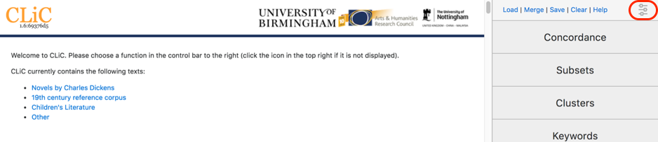

   **Figure:** Close the sidebar menu by clicking on the menu icon in
   the top right corner

.. rubric:: Saving plain and annotated results
   :name: saving-plain-and-annotated-results

The buttons in the top row apply to all analysis tabs:

-  **'Load':** You can upload a previously exported CLiC CSV file to
   restore your settings and your tag annotation (see the 'tagging'
   section below). The CSV file can only be reimported to CLiC if you
   haven't made any changes to it. We would therefore recommend keeping
   the original copy for potentially loading it back into CLiC (as well
   as for your personal record) and saving any manual changes (e.g.
   comments, highlights, filtered lines) in a separate version. Also
   note that the 'Load' function will replace any existing tags in CLiC
   with those from the file; unlike 'Merge', see below
-  **'Merge':** The 'Merge' function will add the tags from the CSV file
   to any pre-existing tags. You can also use this function when you
   have more than one CSV (for example with annotations from several
   researchers) so you can merge these in order to check to what extent
   the tag sets overlap or differ.
-  **'Save':** Save your results, settings and annotated tags in a CSV
   file that can be opened in a spreadsheet viewer. The file contains a
   (shareable) link that will replicate your search settings.
-  **'Clear':** Resets the search settings and any tag columns.
   (Identical to clicking the CLiC icon.)

For both **'Load'** and **'Merge'** the results/queries have to be
compatible, i.e. they have to be based on the same node word.

.. rubric:: Printing the results
   :name: printing-the-results

If you have already saved the results in a CSV file, you may want to
print that file directly from your spreadsheet viewer. However, the CSV
file will not preserve any of the colours or the highlighting that you
may have created with the KWICGrouper function (see the subsection
'Concordance – KWICGrouper' in 5.2 below). In order to print the output
in colour, go to the Chrome printing menu, click on 'More settings' and
tick 'Background graphics' (see
Figure; other browsers
should have similar settings). The layout also tends to print best in
Landscape. You can then “print” the output to a PDF file (as in
Figure) or straight to
your printer.

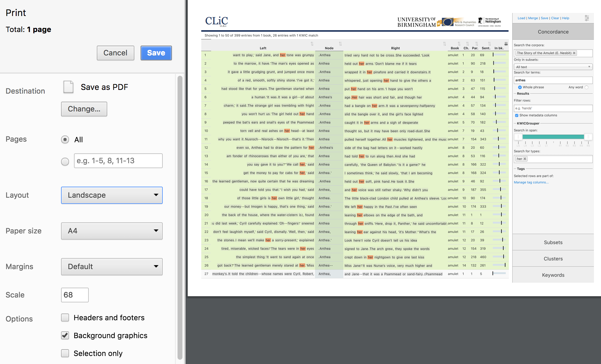

   **Figure:** Settings for printing CLiC output in colour using the
   Chrome print menu

.. rubric:: Concordance
   :name: concordance

Clicking onto the **'Concordance'** tab will take you to the concordance
view. In order to create a concordance, you will need to select a corpus
to search in (see the Section 4 on 'The CLiC Corpora' above).

.. rubric:: Search the corpora
   :name: search-the-corpora

This is where you select a corpus to search in (cf. Section 4). The
selection is very flexible and lets you pick a pre-defined corpus (19th
Century Novels Reference Corpus, Dickens's Novels or Children's
Literature) or choose your own subcorpus – either from books from only
one of these corpora or combining books across the pre-defined corpora.

.. rubric:: Only in subsets
   :name: only-in-subsets

Here you can decide whether you want to search through 'all text' – the
whole book(s) – or just one of the subsets: 'short suspensions', 'long
suspensions', 'quotes' and 'non-quotes' (cf. Section 4).

.. rubric:: Search for terms
   :name: search-for-terms

This is the fundamental parameter of the concordance search – it lets
you determine the node word or phrase that forms the basis of the
concordance. When you type your search word(s), keep in mind the notes
from the tokenisation section above. The node has to be a valid token
according to the white-space tokenisation: for example, a search for a
punctuation sign will not retrieve any results. If your research focuses
on punctuation markers you can evade this issue by using the filter
function in the subset tab: Go to the subset tab, select the relevant
subset, for example non-quotes, and filter the rows to the punctuation
marker of interest.

.. rubric:: 'Whole phrase' or 'Any word'
   :name: whole-phrase-or-any-word

When you have entered several terms, you need to specify whether it is
to be searched as one phrase (equivalent to using double quotes in a
search engine, e.g. *dense fog*) or any of the words individually
(*dense* and *fog*).

.. rubric:: Co-text
   :name: co-text

The maximum number of words in the co-text is set at 10 on either side
in a concordance (depending on the length of the words and the size of
the screen you might see fewer). You can see the full chapter view by
clicking on **'in bk.' (in book) button** at the end of any row (see
Figure).

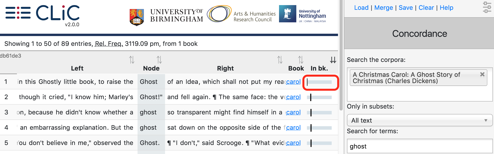

   **Figure:** The 'in bk.' (in book) button leads to the chapter view
   of the occurrence

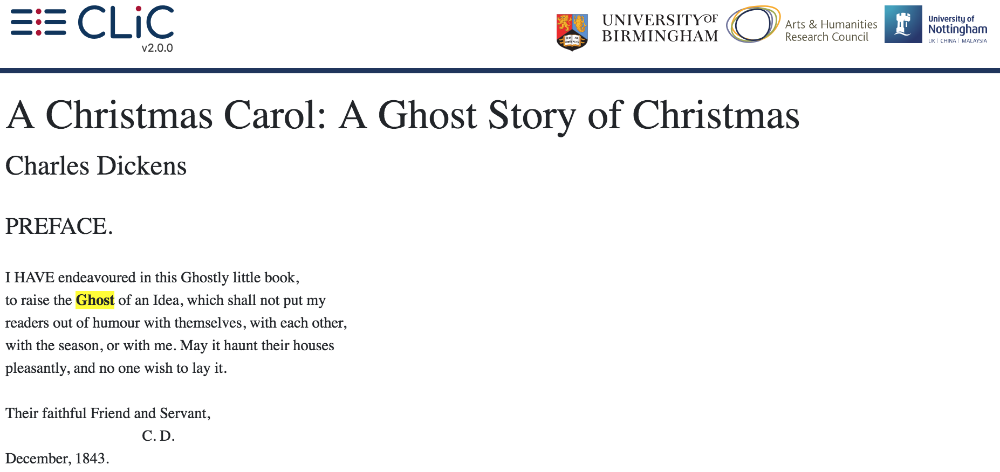

   **Figure:** The 'in bk.' view shows the whole chapter – in the case
   of this preface it is a very short chapter. (Note that all authorial
   text occurring before the official first chapter, is counted as
   'chapter 0' in CLiC). This preface contains no quotes or suspensions;
   compare to the subset markup in the chapter view of Figure.

.. rubric:: Results
   :name: results

These options allow you to adjust the way the concordance output is
displayed.

.. rubric:: Filter rows
   :name: filter-rows

This filter option lets you filter the concordance output by the rows
that contain a particular sequence of letters (both in the node and
co-text). For example, searching for hands in *Oliver Twist* yields 124
results; when we use the option **'filter rows'** and search for
*pockets*, this is filtered down to 8 results as illustrated in
Figure.

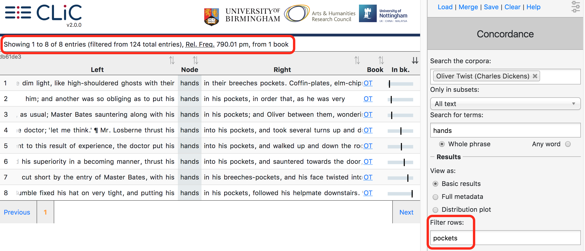

   **Figure:** Concordance of hands in Oliver Twist filtered down to
   pockets in the co-text

Note that the filter, when searching for character sequences does not
necessarily search for complete words: for example, filtering a
concordance of *head* in *Oliver Twist* for *eat* yields both
occurrences of the verb *eat*, and the instance *threatened*, which
contains the same sequence of letters (see
Figure). The
filter function is cruder than the KWICGrouper; it can be usefully
applied to filter down a large set of results before you do a more
fine-grained categorisation. You might want to filter down the results
to rows containing similar word forms. For example, filtering for *girl*
will also retrieve rows containing *girlish* and *girls*. Moreover,
unlike the main concordance search and the KWICGrouper, the filter lets
you search for particular types of punctuation (e.g. round brackets used
in suspensions).

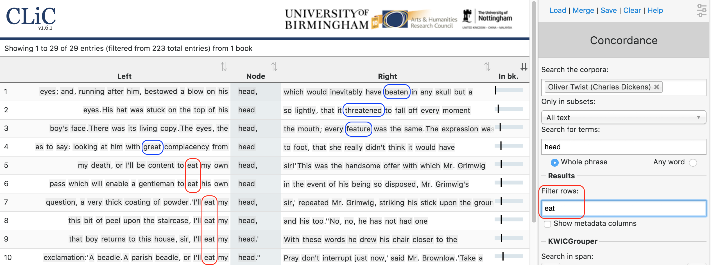

   **Figure:** Filtering for the letter sequence "eat" returns forms of
   the verb eat and other words containing the sequence

.. rubric:: Show metadata columns
   :name: show-metadata-columns

Show the chapter, paragraph and sentence number for each row. (Used to
be “Toggle Metadata” until CLiC 1.5). This illustrates where in the book
you are and can be the basis for sorting (see section on sorting below).

.. rubric:: Basic sorting
   :name: basic-sorting

The concordance lines can be sorted by any of the columns in the
concordance by clicking on the header, which will then be marked with
dark arrows. For example, by clicking on **'Left'** the lines will be
sorted by the first word to the left of the node and by clicking on
**'Right'** by the first word on the right. If you have the metadata
columns activated you can also sort by these, for example to sort all
entries by chapter. Similarly, if you have created your own tags (see
'Manage tag columns' section below), you can sort for lines with a
particular tag. Clicking on the same header a second time will reverse
the order of sorting.

Note that you can create a **“sorting sequence”** by clicking on various
headers while pressing the **shift key**. For example, you could sort a
concordance first by the words on the right and then by book, as
illustrated in
Figure,
which shows a concordance of *fireplace* sorted first by book – so that
results from *Barnaby Rudge (BR)* come first – and then ordered by the
co-text on the right.

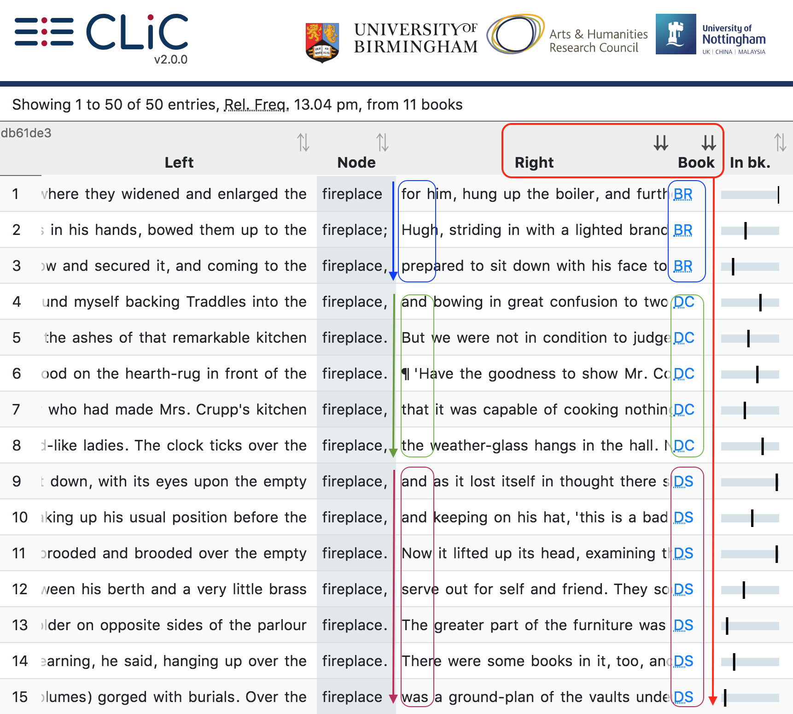

   **Figure:** Concordance of fireplace in DNov (Dickens's Novels) –
   first ordered by book, then by the first word on the right

.. rubric:: KWICGrouper
   :name: kwicgrouper

The KWICGrouper is a tool that allows you to quickly group the
concordance lines according to patterns that you find as you go through
the concordance. For a basic introduction to the KWICGrouper
functionality (in the CLiC 1.5 interface) you can watch our KWICGrouper
video tutorial from May 2017\ `[8] <footnotes.html>`__

The idea of the KWICGrouper is that you look for patterns as you search
for particular words. Any matching lines will be highlighted and moved
to the top of the screen. Among the matching lines we further
distinguish between the lines based on how many matches they contain. A
line with one match is highlighted in light green, lines with two
matches are coloured in a darker green, those with three in purple and,
finally, those with four in pink. (For lines with more matches than
these, the colours with repeat.) The KWICGrouper gives you two options:

-  **'Search in span':** Set the span for the KWICGrouper search. By
   dragging the slider you can adjust the number of words that will be
   searched to the left and right of the search term. The maximum (and
   default) span is 5 positions to either side.
-  **'Search for types':** Choose one or more words to search for in the
   span. This is currently limited to single words, but there is no
   limit on how many words you add.

The total number of matching rows will be displayed at the top; the
process is illustrated in
Figure and
Figure.
Figure shows
the plain concordance lines as returned when searching for *fire* in
Dickens's novels.

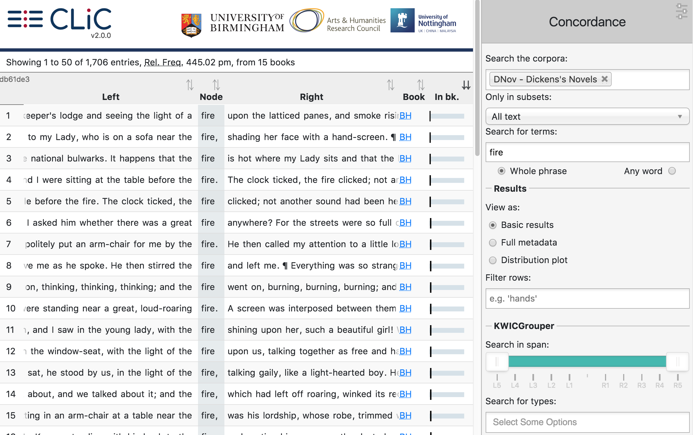

   **Figure:** The first concordance lines of fire in DNov (Dickens's
   Novels) with the default sorting by 'in bk'

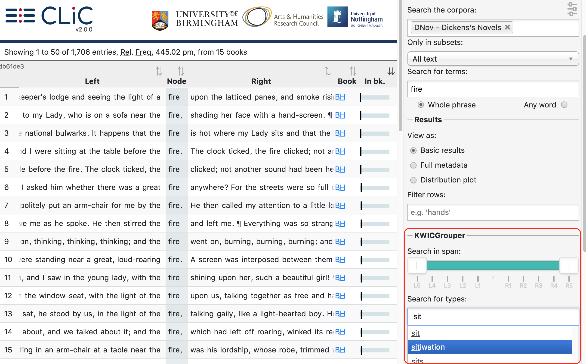

   **Figure:** Selecting types related to sitting from the KWICGrouper
   to group the concordance lines

Figure
illustrates the process of choosing types (forms of words) from co-text
surrounding *fire* in the concordance in order to group the concordance
lines. The dropdown only contains those word forms that actually appear
around the node term in the specified search span. Therefore, while
*sitiwation* is listed here, it wouldn't be listed if we had searched
for another node term or used other books; it only appears once in this
set in the following Example context:

   I don't take no pride out on it, Sammy,' replied Mr. Weller, poking
   the fire vehemently, 'it's a horrid **sitiwation**. I'm actiwally
   drove out o' house and home by it.The breath was scarcely out o' your
   poor mother-in-law's body, ven vun old 'ooman sends me a pot o' jam,
   and another a pot o' jelly, and another brews a blessed large jug o'
   camomile-tea, vich she brings in vith her own hands.'

   *[Pickwick Papers, Chapter LI.]*

.. figure:: images/figure-analysis-concordance-kwicgrouper-fireresults.png
   :alt: figure-analysis-concordance-kwicgrouper-fireresults

   **Figure:** The resulting 'KWICGrouped' concordance lines: the
   selected types are listed in the search box on the right; and in the
   case of this example it is suitable to restrict the search span to
   only the left side of the node

The KWICGrouper only searches through a number of words to the left and
right of the node term, as specified by the search span.
Figure shows
the resulting concordance lines according to the KWICGrouper settings
after manually choosing types related to the action of sitting. Apart
from the selected search types the search span has also been restricted
to the left side so that clearer patterns of sitting by the fire become
visible.

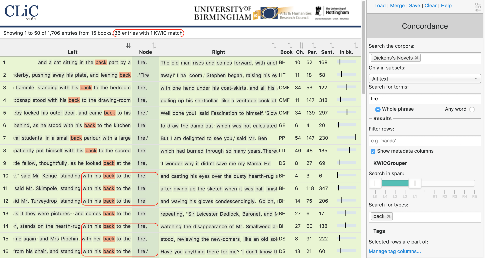

   **Figure:** The first lines of fire co-occurring with back (i.e. one
   KWICGrouper match) are highlighted and moved to the top

Apart from looking for characters sitting by the fire, it might also be
of interest to look for characters standing by the fire. We have shown
in our previous work (see chapter 6 of Mahlberg
2013\ `[9] <footnotes.html>`__) that the cluster with *his
back to the fire* is prominent in Dickens's and 19th century novels by
other writers.
Figure shows the
first concordance lines of *fire* with *back* on the left (sorted to the
left).

The output from the KWICGrouper lists at the top of the screen the
number of lines that contain any number of matches. In the case of
Figure and 15
there are only lines with one match, but no lines with more than one
match. So, in
Figure, the
message says “36 entries with 1 KWIC match”, this means that 36 lines
contain both *fire* and *back*. This function becomes useful when we now
look for gendered pronouns. As shown in
Figure, there
are 27 lines in which *fire* co-occurs with both *back* and *his*. Most
of these occurrences appear in the pattern with *his back to the fire*,
as becomes obvious when we reverse the sorting on the left so that the
occurs at the top in the first position to the left of *fire* – the L1
position. On the other hand, as we can see from
Figure,
Dickens's novels contain only instance of *fire* co-occurring with
*back* and *her* (with *her back to the fire*).

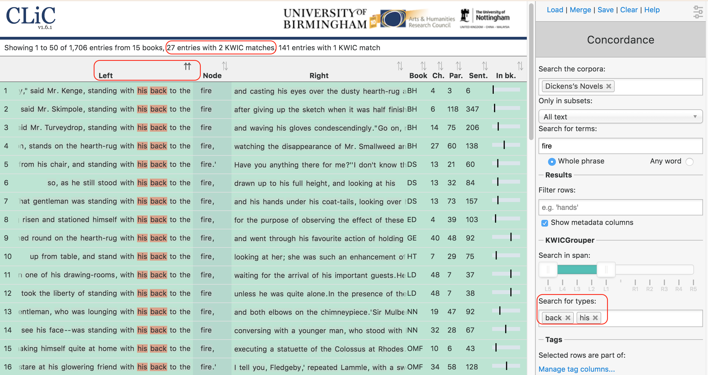

   **Figure:** The 27 lines with two matches (here, back and his) are
   highlighted in a darker green

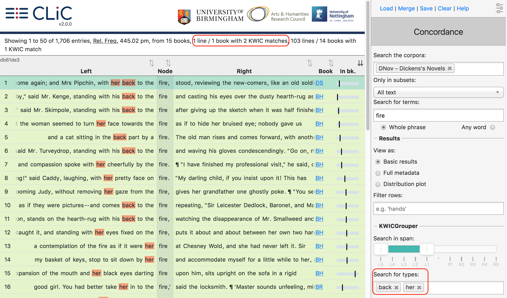

   **Figure:** Only one line contains both back and her; it is
   highlighted and shown above single match lines

.. rubric:: Manage tag columns
   :name: manage-tag-columns

Once you have identified lines with patterns of interest, you might want
to place these into one or more categories. CLiC provides a flexible
tagging system for this.
Figure illustrates
the outcome of what a tagged concordance can look like. The tags are
user-defined so you can create tags that are relevant to your project.
In this case, occurrences of *dream* in *Oliver Twist* have been tagged
according to who is dreaming.

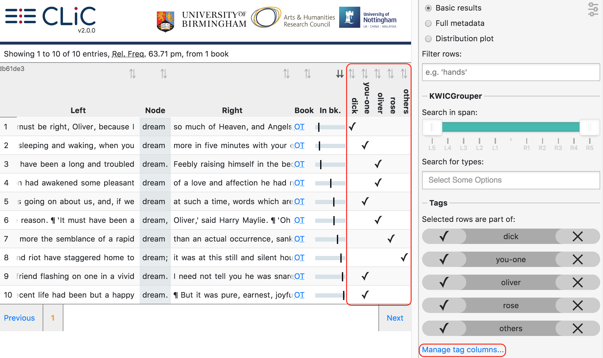

   **Figure:** Tagged concordance lines of dream in Oliver Twist

In order to tag the lines, click on **'manage tag columns'** (shown in
the bottom right corner of
Figure) and create
your own tag(s) through the **'Add new'** option (see
Figure). You can
rename a tag by selecting it from the **'Tag columns'** list and
renaming it in the text box. Once you have created your tag(s), you can
click **'Back'** to return to the menu. Now you can select the relevant
concordance lines by clicking on them and you will see that the sidebar
contains the list of your tags. Once one or more lines are selected you
can click the tick next to the relevant tag in order to tag the line
(see Figure).
An extra column will appear for each tag and you can sort on these
columns as mentioned in the sorting section above. Selected and tagged
rows will be automatically deselected when you click on (i.e. select) a
new row.

.. figure:: images/figure-analysis-concordance-tagcolumns-menu.png
   :alt: figure-analysis-concordance-tagcolumns-menu

   **Figure:** The menu for adding and renaming tags

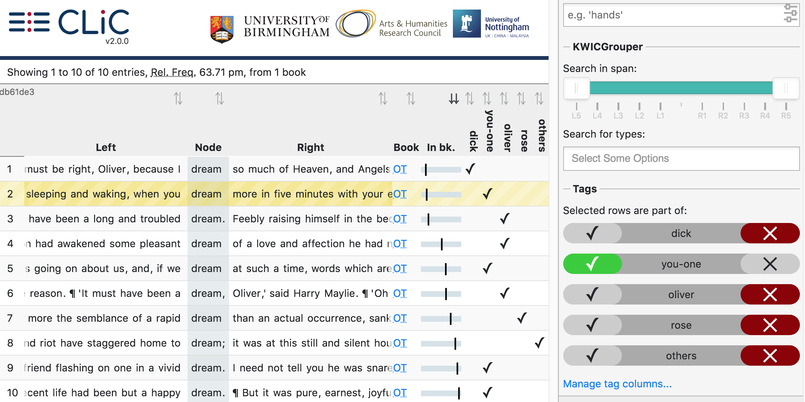

   **Figure:** Select a line (by clicking on it) in order to apply an
   existing tag; once tagged, the tick in the sidebar will appear green
   for the selected line. A tick will also be added to the tag column in
   the concordance itself

.. rubric:: Subsets
   :name: subsets

The Subsets tab can display the full subset of your choice for the
selected corpus. Therefore, you can retrieve all quotes or all long
suspensions, etc. in any of the books or pre-selected corpora for
further analysis. Note that we find this option most useful for the
smaller subsets, i.e. quotes and suspensions; if you select the whole
'non-quotes' subset the output may become unwieldy.

.. rubric:: Show subsets
   :name: show-subsets

Click onto the dropdown **'Show subsets'** (see
Figure) to select a relevant
subset (short suspensions, long suspensions, quotes or non-quotes). You
will also need to choose a corpus.

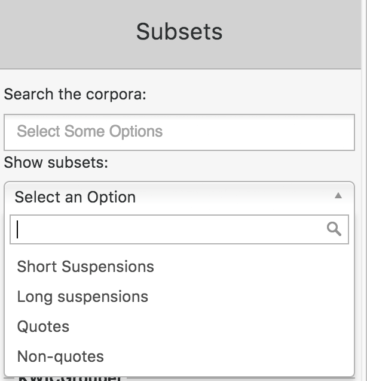

   **Figure:** The basic subset options

Figure shows sample
lines from the subset of long suspensions in *Oliver Twist*. You can
then use the filter option to narrow down the lines and group them using
the KWICGrouper. As in the concordance tab, you can create tags to
annotate rows with noteworthy patterns

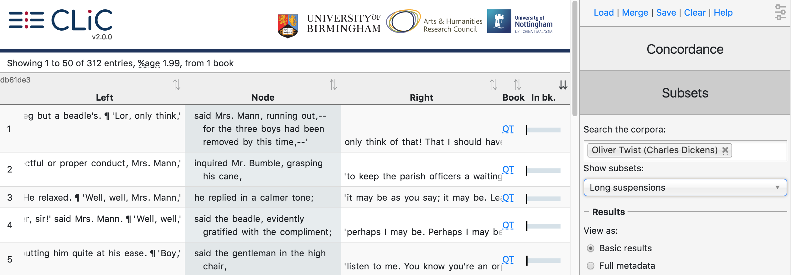

   **Figure:** The first few lines from the subset of 'long suspensions'
   in Oliver Twist

.. rubric:: Results
   :name: results-1

Like in the concordance tab, this allows you to adjust the way the
concordance output ('table') is displayed.

.. rubric:: Filter rows
   :name: filter-rows-1

The filter option lets you filter the output by the rows that contain a
particular sequence of letters, as described in Section 5.2 on the
filter function in the Concordance tab. For example, you could filter
suspensions for particular speech verbs like *cried*
(Figure).

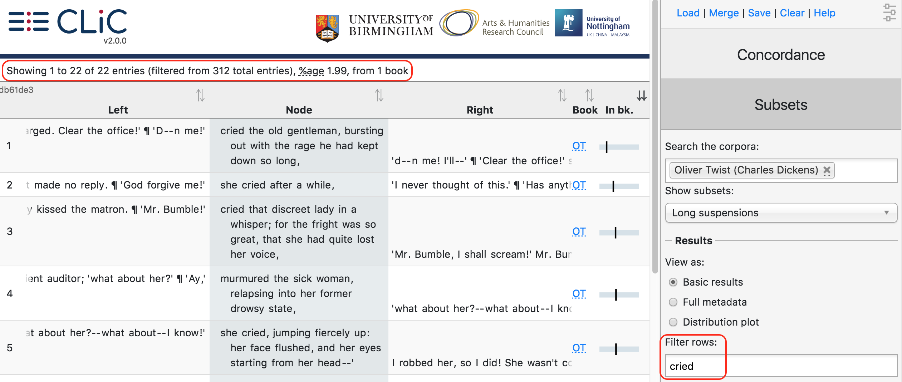

   **Figure:** Filtering long suspensions in Oliver Twist for cried

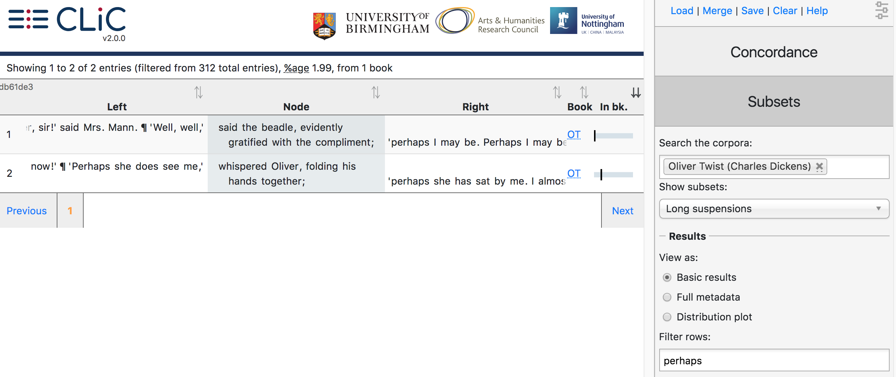

   **Figure:** Filtering the co-text of long suspensions for perhaps in
   Oliver Twist

Note, however, that the filter will search through the whole row and
therefore also accounts for words in the context, not only in the subset
itself. For example, when searching through the subset of long
suspensions in *Oliver Twist* and filtering rows for *perhaps* the
results originate only from the co-text, as *perhaps* does not occur in
long suspensions (see
Figure).

.. rubric:: KWICGrouper
   :name: kwicgrouper-1

If you want to restrict your search to the subset itself, the
KWICGrouper is the better option; it will also highlight your search
terms, as described in Section 5.2 on concordances. The Subset
KWICGrouper works like the Concordance KWICGrouper, with the exception
of its search span which operates only on the subset itself. See
Figure
for an illustration of the Subset KWICGrouper searching for lines with
*cried*, *screamed* and *sobbed*.

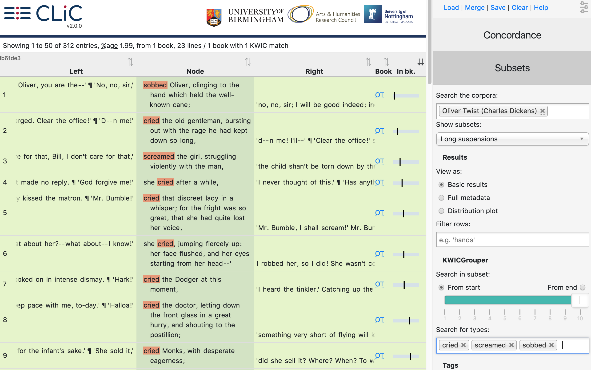

   **Figure:** The search span of the Subset KWICGrouper applies to the
   subset; not to the co-text

.. rubric:: Manage tag columns
   :name: manage-tag-columns-1

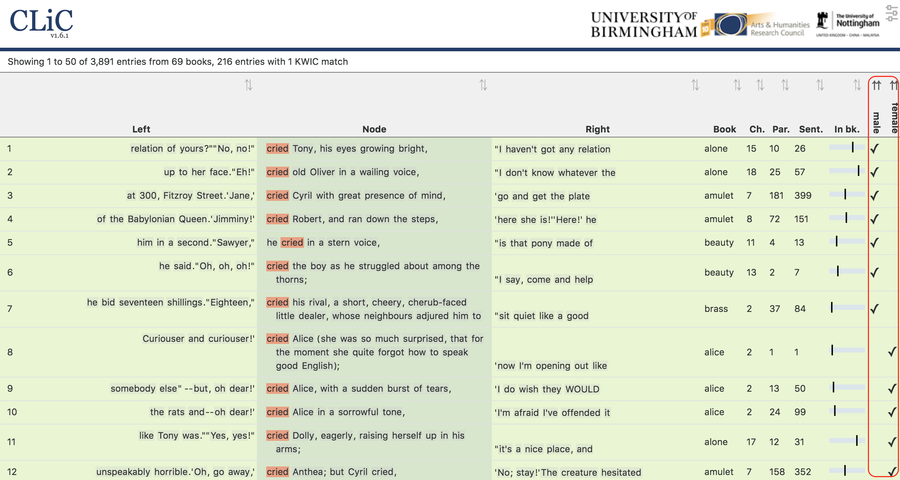

   **Figure:** Tagging subsets – here, long suspensions in ChiLit
   containing cried are tagged for character gender

Just like in the Concordance tab (Section 5.2), subset rows can be
annotated with user-defined tags.
Figure shows a
potential application of tagging subsets: long suspensions in the 19th
Century Children's Literature (ChiLit) corpus containing *cried* are
tagged for whether the crying character is male or female. Note that
this screenshot just illustrates the technique; it does not represent
the actual gender distribution of *cried* in the ChiLit long
suspensions.

.. rubric:: Clusters
   :name: clusters

The output of the cluster tool generates frequency lists of single words
and 'clusters' (repeated sequences of words). Clusters are also called
'n-grams', where 'n' stands for the length of the phrase. If we choose a
'1-gram' (single word), we retrieve a simple word list. (In *Oliver
Twist*, for example, the top 10 words retrieved from this tool are *the,
and, to, of, a, he, in, his, that* – all function words, as we would
generally expect.) CLiC currently supports 1-grams (single words),
3-grams (like *i don't know*) 4-grams and 5-grams (*what do you mean
by*), as illustrated in Figure.

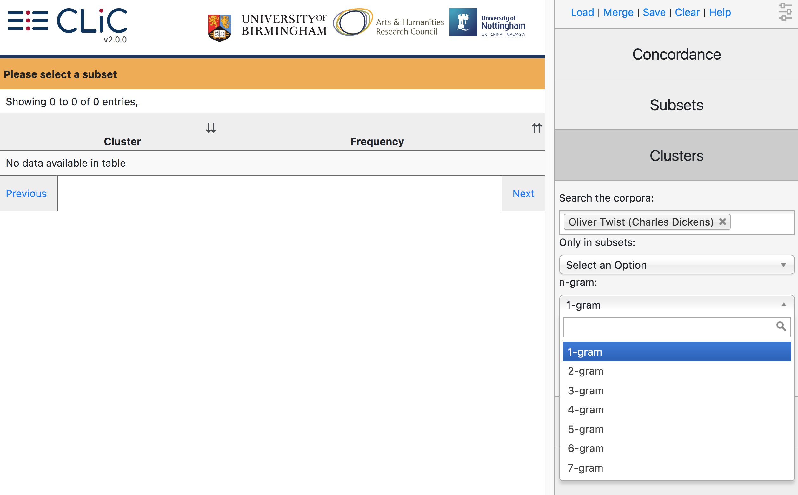

   **Figure:** Cluster options

As in the other tabs, you can restrict the search to a particular subset
(see Figure – **'Only in subsets:
Select an Option'**) so that, for example, you can create frequency
lists for clusters in quotes (or any of the other subsets). You can save
the resulting list as a CSV file (for example for use in a spreadsheet
viewer) by clicking the **'Save'** button at the top. Note that the CLiC
'Cluster' tab will display words and clusters with a minimum frequency
of 5.

.. rubric:: Keywords
   :name: keywords

The keywords tool finds words (and phrases) that are used significantly
more often in one corpus compared to another. CLiC incorporates the
keyword extraction formula reported by Rayson and Garside
(2000)`[10] <footnotes.html>`__. Apart from comparing single
words, CLiC also allows you to compare clusters. Whereas the cluster tab
focuses only on one corpus, the Keywords function can compare cluster
lists. You have to make selections for the following options (also see
Figure):

-  **'Target corpora':** Choose the corpus/corpora that you are
   interested in.

   -  'within subset': Specify which subset of the target corpus you
      want to compare (or simply choose 'all text')

-  **'Reference corpora':** Choose the reference corpus to compare your
   target corpus to.

   -  'within subset': Specify the subset for the reference corpus.

-  **'n-gram':** Do you want to compare single words (1-grams) or
   phrases (2-grams up to 5-grams

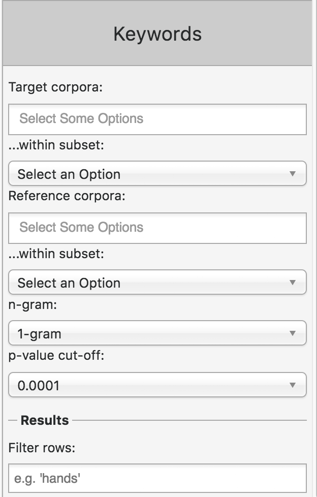

   **Figure:** The settings for the keywords tab require you to select
   two sets of corpora for the keyword comparison – target and reference
   – and their corresponding subsets

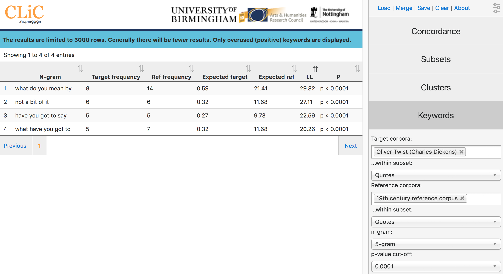

   **Figure:** Key 5-word clusters in Oliver Twist 'quotes' compared to
   'quotes' in the 19th Century Reference Corpus

Note that you have to select a subset for each of the two corpora or
you'll see the error message: “Please select a subset”. So, for example,
when comparing 5-grams in *Oliver Twist* (quotes) against the 19th
Century Reference Corpus (quotes), we retrieve the results displayed in
Figure (for a p-value of
0.0001). The keyword output is by default ordered by the log-likelihood
(LL) value, the 'keyness' statistic used here (for more details on the
calculation, please refer to Rayson and Garside, 2000).

The frequency threshold of 5 used for the cluster tab is not applied to
the keyword tab, so that all frequencies are compared. The keyword
output shows the top 3000 results (for most comparisons, you will yield
fewer results, though). Moreover, CLiC only generates so-called
'positive keywords': those that are 'overused' in the target corpus than
in the reference corpus, but CLiC does not generate 'negative' or
'underused' keywords.
