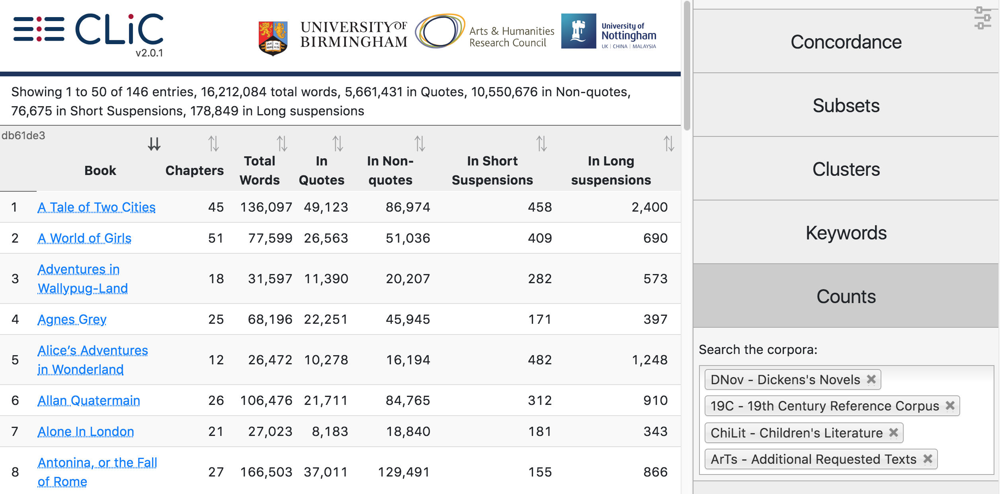

Counts
======

The counts tab lists information about individual books and all books in  a corpus:

* Book title
* Number of chapters
* Total number of words
* Number of words in quotes
* Number of words in non-quotes
* Number of words in short suspensions
* Number of words in long suspensions 

You can create a counts table for a single book or a selection of books. numref:`figure-analysis-counts` shows the complete table for all books in CLiC (this may take a while to load). 

.. _figure-analysis-counts:

   Counts overview for all corpora in CLiC