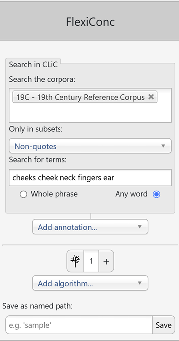
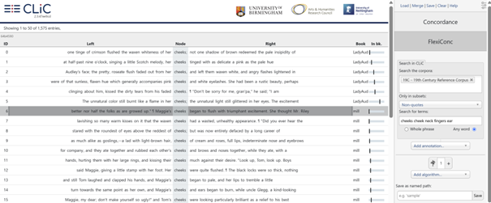
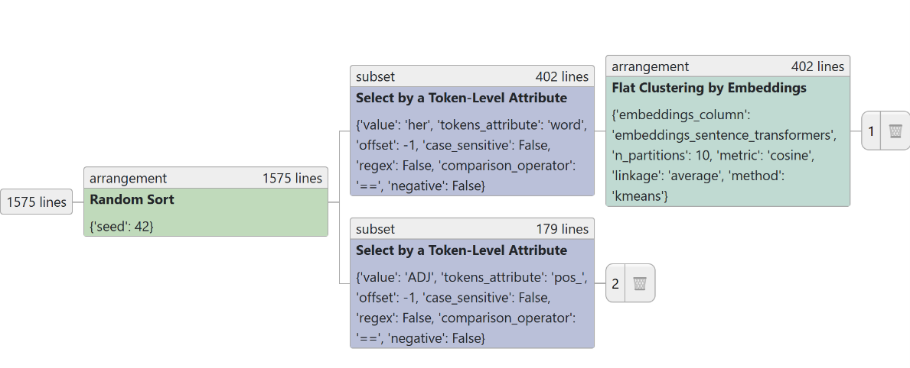
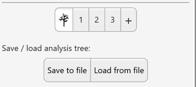
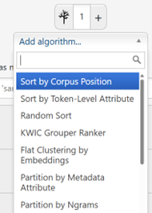
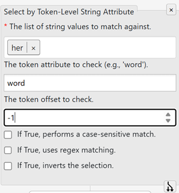
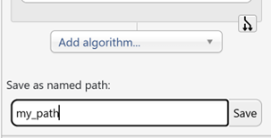
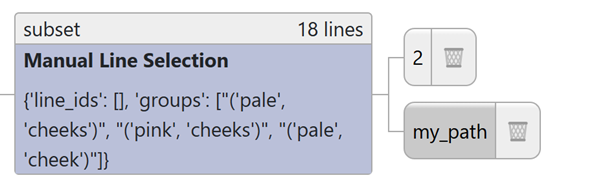
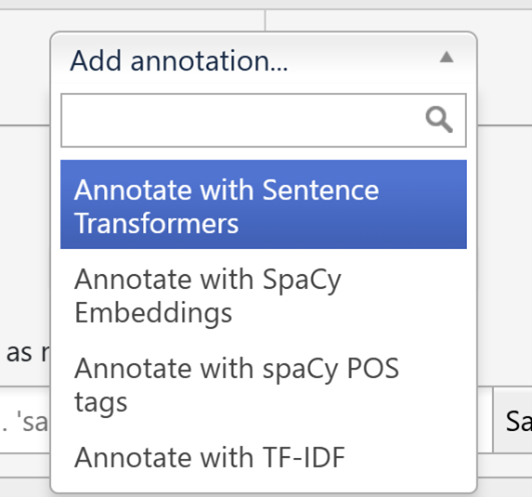
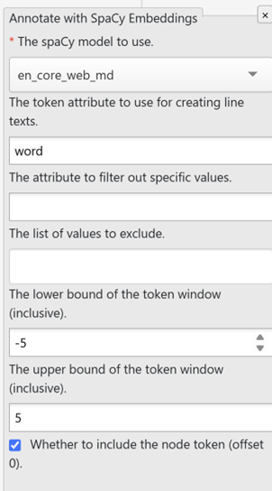

FlexiConc
=========

**'FlexiConc'** is a Python library developed to support corpus linguists by supporting the analysis of concordances. CLiC incorporates FlexiConc functionality in a dedicated analysis tab.

Starting FlexiConc
------------------
After selecting FlexiConc in the sidebar, the initial query window looks identical to the one in the Concordance tab, with some additional buttons underneath.

.. _flexiclic_query:

   
Figure 1: Query in FlexiConc mode in CLiC.

To create a Flexiconc analysis tree, you will need to select a corpus to search in (see :ref:`The CLiC corpora`). 

Search the corpora
~~~~~~~~~~~~~

This is where you select a corpus to search in. The selection is very flexible and lets you pick a pre-defined corpus (see :ref:`The CLiC corpora`)
or choose your own subcorpus – with any of the books available in CLiC.

Only in subsets
~~~~~~~~~~~~~

Here you can decide whether you want to search through 'all text' – the whole book(s) – or just one of the subsets: 'short suspensions', 'long
suspensions', 'quotes' and 'non-quotes' (see :ref:`The CLiC corpora`).

Search for terms
~~~~~~~~~~~~~

This is the fundamental parameter of the concordance search – it lets you determine the node word or phrase that forms the basis of the concordance.

The tokenisation from CLiC 2.0 onwards is based on unicode standard rules (i.e. Unicode word boundaries implemented with the [ICU]_ library), used
both for queries and importing books.

We consider a boundary mark to be a word-boundary if...
* The [ICU]_ library describes it as at the end of a word, e.g. ``jump`` or number, e.g. ``32.3``.
* It is a single hyphen character surrounded by alpha-numeric characters.
* It is an apostrophe preceded with ``s``, e.g. ``3 days' work``.
* It is one of a whitelist of words preceded with an apostrophe, e.g. ``'tis``.

CLiC 2.0 and onwards supports **wildcards**:

* ``*`` means "zero or more characters", for example:
  
  Placing * at the end of a the sequence ``can`` serves as a placeholder for
  any sequence of characters (or zero) and therefore retrieves all instances of 
  words starting with this sequence, including ``can``, ``cannot`` and ``can't``
  (but also ``candle``, ``candles``, ``candlestick`` etc.)
  
  ``*`` in ``with * hands`` serves as a placeholder for any word token
  between ``with`` and ``hands``, retrieving sequences like ``with her hands``, 
  ``with his hands``, ``with their hands``, ``with both hands``, 
  ``with clean hands`` etc.

* ``?`` means "one"

The search will only retrieve valid tokens according to the rules above.
This means that the search will ignore punctuation in your search query except for 
punctuation sign will not retrieve any results. If your research focuses
on punctuation markers you can evade this issue by using the filter
function in the subset tab: Go to the subset tab, select the relevant
subset, for example non-quotes, and filter the rows to the punctuation
marker of interest.
Two hyphens separate words: for example, *Char--lotte* in Oliver
Twist (OT.c6.p20) “Oliver's gone mad! Char--lotte!” counts as two
tokens.

For the detailed technical documentation and more examples see :mod:`clic.tokenizer`.

'Whole phrase' or 'Any word'
~~~~~~~~~~~~~

When you have entered several terms, you need to specify whether it is
to be searched as one phrase (equivalent to using double quotes in a
search engine, e.g. *dense fog*) or any of the words individually
(*dense* and *fog*).

Search results
~~~~~~~~~~~~~
In the screenshot in Figure 1, we are searching the 19C corpus of 19th century English novels. We focus on non-quotes – all parts of the text that are not part of a character’s direct speech. Within this subset, the search terms are cheeks, cheek, neck, fingers, and ear. These are examples of body-part nouns that appear in the mid-level frequency range in this corpus. Thus, neither of them is extremely common or infrequent. Searching for any word ensures that all terms are searched separately, rather than searching for the rather nonsensical string “cheeks cheek neck fingers ear” as a sequence. The resulting concordance view looks like this:

.. _flexiclic_first_result:

   
Figure 2: Initial concordance in FlexiConc mode.

Concordancing strategies
------------------

FlexiConc takes the query result as input and allows you to perform different steps, which are operationalized as *algorithms*.

Each FlexiConc algorithm performs an operation that belongs to one of three central categories:

1.	**Selecting**
  Focus on specific subsets of concordance lines based on a variety of criteria, including metadata categories and contextual keywords.
2.	**Ordering**
  Arrange concordance lines by sorting or ranking them, using numeric preference scores to prioritize those of interest.
3.	**Grouping**
  Organize lines into groups by applying explicit partitioning criteria or through clustering based on similarity measures.

Analysis tree
------------------

FlexiConc organizes the concordancing process in an analysis tree. Algorithms can be applied sequentially in a hierarchical structure, meaning that you can ‘branch off’ the analysis on any level. For instance, you can apply a sorting algorithm to a subset, which results in only that subset being sorted. Alternatively, you can apply the same sorting algorithm to the concordance lines that you obtained the subset from, which would lead to all lines within that view being sorted.

By default, your analysis has one branch, which is started when you run the query, and is represented by the button with the number 1 next to the tree symbol. Clicking on the tree symbol takes you to an overview of the entire analysis tree:

.. _flexiclic_tree:

   
Figure 2: Analysis tree

In this example, we started from the concordance shown in the initial query, which contains 1,5 75 lines. We applied a **random sort** – which is an arrangement node (in that it changes the order of lines). From there, the analysis branched off in two directions: 

# ``Branch 1`` is a subset based on **select by a token-level attribute**. In this case, the concordance view is limited to lines containing the token *her* in the L1 position (= *offset -1*). We then applied an *arrangement* node, **flat clustering by embeddings**. This is a grouping algorithm that sorts concordance lines into textually similar partitions.

# ``Branch 2`` is also a subset of the concordance. Like in branch 1, it subsets the concordance by **select by a token-level attribute**. However, in branch 1, the attribute was a specific token (*her*). In branch 2, we instead use the attribute **pos_** as a filtering criterion, which is a part-of-speech tag that was added as an annotation layer to the overall concordance in an *annotation* step. 

Like the selection for her in branch 1, this subset selects based on the L1 position, this time, the selection criterion is that pos_ has the value *ADJ*. In other words, we are selecting lines where the node is preceded by an adjective.

Clicking on the **numbers at the end of each branch** takes you to the respective branch, where you can add more algorithms to it.

Saving and loading the tree
~~~~~~~~~~~~~
While you are in the tree view, you will also see a **save and a load button**, as seen in Figure 3.

.. _flexiclic_save_tree:

   
Figure 3: Save and load buttons for the analysis tree

Clicking on ``save to file`` initiates a download, where the entire tree structure is stored as a JSON file. 

You can ``load`` this file back into FlexiConc to recreate your analysis at any point. This also allows you to directly share your analysis with other researchers or students.

Adding algorithms
------------------

When you are on a branch, clicking on the ``add algorithm`` button shows all available algorithms. You can scroll down or use the search bar to type an algorithm name. The menu is shown in Figure 4.

.. flexiclic_algo:

Figure 4: Adding an alogrithm to the tree

# Adding a new algorithm below an existing one will create a new node on the same branch. 

# Clicking on the ``plus sign +`` next to the tree symbol creates a new branch on the top level. 

# By clicking on the ``branch symbol`` at the bottom of a node, you create a new branch below that node. 
In the example in Figure 5, the new branch would be initiated containing all steps up to, and including, the algorithm ``select by token-level string attribute``, but not any steps carried out below.

.. flexiclic_algo_options:

Figure 5: Branching off from an existing branch

As we have seen so far, the branches are numbered by default; and the number automatically counts up in the order of branch creation. This is a useful default, as the numbering then serves as a record of the order in which your analysis gradually built up. However, there are cases where the numbering isn’t enough to keep track of your results. You can therefore create a named path for any given branch by using the menu below the ``Add algorithm`` button, as shown in Figure 6:

.. flexiclic_named_path:

Figure 6: Naming a path

Creating a named path will not overwrite your numbered path. Instead, it creates a copy that is stored separately under the name that you chose, and which you can access through the tree view just like a numbered path. After creating a named path, you will stay on the numbered path you have copied. 

**Named paths are immutable**, i.e., you cannot append any algorithms to them.

Named paths are also displayed in the tree view. In Figure 7, you can see that ``branch 2`` and ``my_path`` currently share the exact same sequence of algorithm steps:

.. flexiclic_named_path_tree:

Figure 7: Named path in the tree view

Annotations
------------------

Annotations are automatic analyses of the concordance data that are added to the concordance through some external source of information. Once it has been added, you can use annotations in various sorts of algorithms. You can find the annotations in the add annotation toolbar located right below the query window, as shown in Figure 8.

.. flexiclic_annotations:

Figure 8: Adding annotation

Currently, two **types of annotations** are available:

``Similarity scores`` calculate the similarity between concordance lines. 
    We offer three distinct types of similarity annotation: sentence transformers, SpaCy embeddings, and TF-IDF score. 

Each of these similarity measures offers a range of settings to specify how the similarities should be calculated. In Figure 9, you can see the options for ``Annotate with SpaCy Embeddings``: in particular, you need to specify the **model** and, optionally, the **offsett** if you want to obtain similarities for a fixed context window.

.. flexiclic_annotations_spacy:

Figure 9: Option for adding annotation with SpaCy embeddings

Similarity measures can be used in the Flat clustering by embeddings algorithm, which creates groups based the similarity scores by applying k-means or agglomerative clustering.

The second type of annotation that is integrated are ``part-of-speech (POS) tags``, which are again provided by spaCy models. POS tags are labels that provide a grammatical analysis of each token in the text, e.g. identifying words as nouns or adjectives. In contrast to the similarity annotations, POS tags are not comparisons that result in a score. Instead, they can be used in any algorithm that operates on token-level attributes. In other words, you can use these tags much in the same way that you might use the token itself in a specific position. For example, the tree in figure 2 contains a select algorithm with the condition that the token left to the node has to be an adjective.
