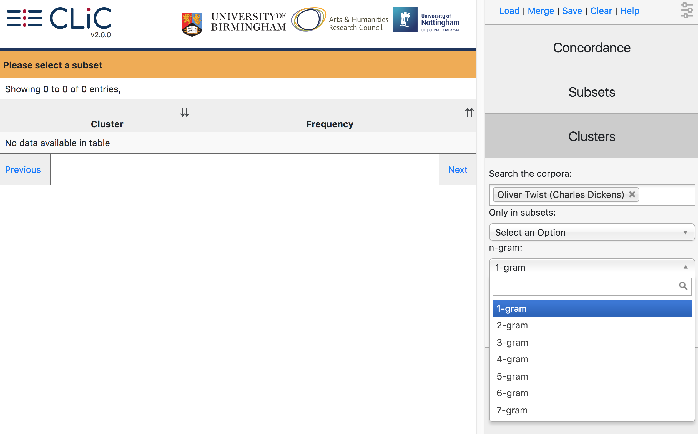

.. _ngrams:

N-grams
=======

The output of the n-gram tool generates frequency lists of single words
and 'n-grams' (repeated sequences of words). N-grams are also called
'clusters'.

If we choose a
'1-gram' (single word), we retrieve a simple word list. (In *Oliver
Twist*, for example, the top 10 words retrieved from this tool are *the,
and, to, of, a, he, in, his, that* – all function words, as we would
generally expect.) From version 2.0 onwards, CLiC supports n-grams of
length 1 (single words) up to 7 (`i am very much obliged to you`), as
illustrated in :numref:`figure-analysis-ngrams`.

.. _figure-analysis-ngrams:

   N-gram options

As in the other tabs, you can restrict the search to a particular subset
(**'Only in subsets: Select an Option'**) so that, for example, you can
create frequency lists for n-grams in quotes (or any of the other
subsets). You can save the resulting list as a CSV file (for example for
use in a spreadsheet viewer) by clicking the **'Save'** button at the
top. Note that the CLiC 'N-grams' tab will display words and n-grams
with a minimum frequency of 5.
