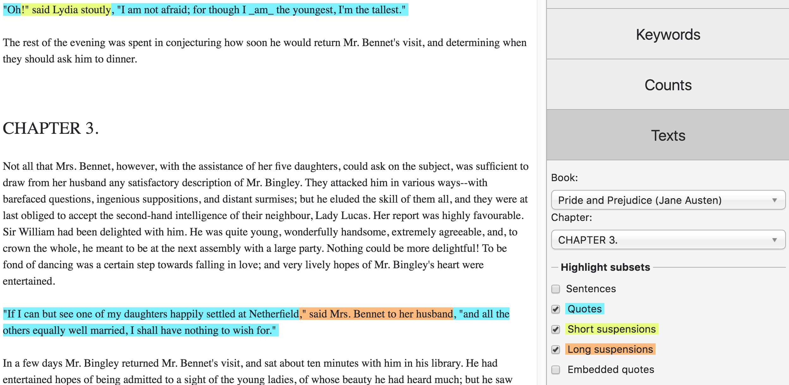

Texts
=====

The 'Texts' tab shows the full text of individual books and allows you to navigate to particular chapters. Selections of the text can be easily copied and pasted into other applications (e.g. Microsoft Word documents).

By default the text view is plain, i.e. it won't show any annotation unless you tick the options. You can select the levels of annotation you want to display, such as “Sentences”, and the “Quote” and “Non-quote” subsets, etc. Figure :numref:`figure-analysis-texts` illustrates the annotation views for quotes, short suspensions and long suspensions in *Pride and Prejudice*.

.. _figure-analysis-texts:

