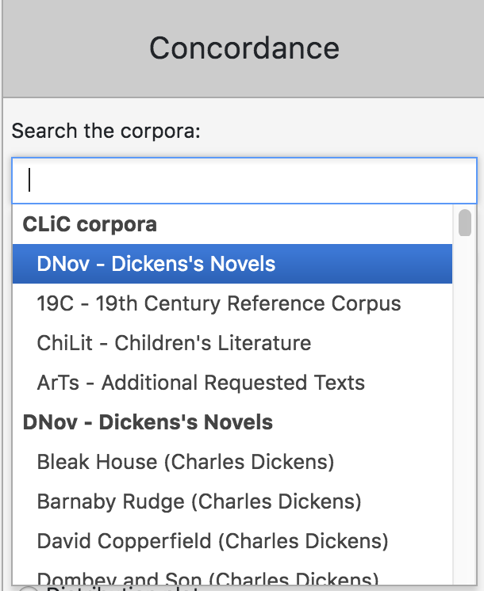
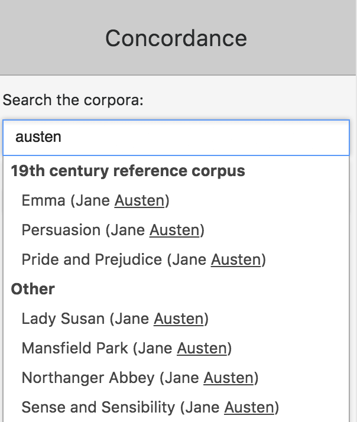
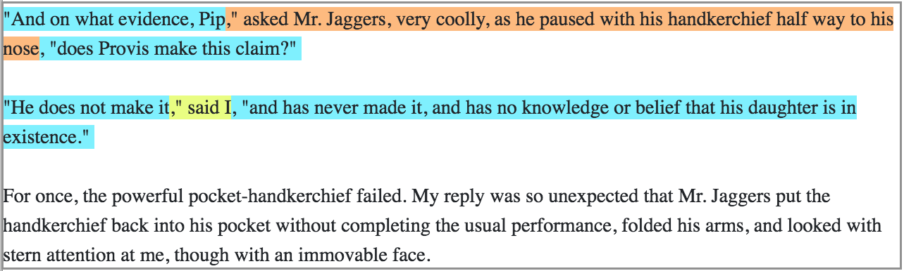

.. _CLiC-corpora-label:
The CLiC corpora
================

An overview of the corpora available in CLiC can be seen from the Counts tab. 
Simply choose the corpus for which you want to see the list of books and the 
Counts tab will provide a table listing the names and word counts for each book, 
per subset and in total.

As of version 1.6.1, released in November 2017, CLiC contains 138 texts, 
mainly from the 19th century; for a full list of titles please refer to Appendix 1.
The procedure followed for retrieving, cleaning and importing the most
recent texts is described in detail on our GitHub
repository\ `[5] <footnotes.html>`__. The texts can be
selected individually and combined freely for analysis in any of the
CLiC tools\ `[6] <footnotes.html>`__. You can also choose from
one of our four pre-selected corpora: DNov – Dickens's Novels (15
texts), 19C – 19th Century Reference Corpus (29 texts), ChiLit – 19th
Century Children's Literature Corpus (71 texts) and ArTs –Additional
Requested Texts (23 texts). ArTs includes additional GCSE and A-Level
titles (please see Appendix 2 for an overview of all CLiC texts listed
in the AQA, OCR and Edexcel GCSE and A-Level English specifications).

In order to **select texts** in any of the CLiC analysis tabs, go to
control bar on the right-hand side (circled in
Figure above). You can select any or all of
the texts by picking the corpora from a drop-down list or typing their
names into a textbox. For example, in the Concordance tool, once you
have clicked on the Concordance tab, a textbox labeled **'Search the
corpora'** will appear (for more information on the Concordance tab, see
Section 5.2), as illustrated in Figure.

   **Figure:** Selecting corpora in the Concordance tab (same procedure
   in Subsets and Clusters; for Keywords see Section 5.5)

You can select the pre-selected corpora in their entirety or you can
pick individual books from them, effectively creating your own
subcorpus. For example, you could select several books from Dickens,
several books from the 19th Century Reference Corpus (19C) and several
books from the 19th Century Children's Literature Corpus (ChiLit). 

You can also select an author-based corpus from the drop-down. For example,
typing *austen* into the textbox (which is not case-sensitive) gives you the option of selecting all 
books by Jane Austen at once (see Figure).

   **Figure:** Example of creating an author-based corpus:
   selecting all of Jane Austen's novels

The CLiC corpora have been marked up to distinguish between several
textual subsets of novels. The Example
from Great Expectations below illustrates the subsets and
Figure shows how these are marked up
in the chapter views, which can be retrieved from the 'in bk.' (in book)
button in concordances (see Section 5.2) and the table of contents on
the homepage.

   "And on what evidence, Pip," asked Mr. Jaggers, very coolly, as he
   paused with his handkerchief half way to his nose,"does Provis make
   this claim?”

   "He does not make it," said I, "and has never made it, and has no
   knowledge or belief that his daughter is in existence.”

   For once, the powerful pocket-handkerchief failed. My reply was so
   unexpected that Mr. Jaggers put the handkerchief back into his pocket
   without completing the usual performance, folded his arms, and looked
   with stern attention at me, though with an immovable face.

   *[Great Expectations, Chapter 51]*

-  quotes: any text listed in quotes, i.e. mostly character speech but
   also thoughts or songs that might appear in quotes
-  non-quotes: narration

   -  and a special case of non-quotes, suspensions, which represent
      narratorial interruptions of character speech that do not end with
      sentence-final punctuation. Suspensions are further divided by
      length:

      -  short suspensions have a length up to four words
      -  long suspensions have a length of five or more words

   **Figure:** Chapter view of example (1) (retrieved via the 'in bk.'
   (in book) button in a concordance of asked Mr Jaggers very coolly),
   exemplifying the mark-up of subsets

The rationale behind the division of the subsets can be found in the open access article by
Mahlberg et al. (2016)\ `[7] <footnotes.html>`__. However, the tagging procedure for CLiC 
corpora has changed since the publciation of this paper - please see the 
`tagger documentation <https://github.com/birmingham-ccr/clic/blob/2.0-beta1/server/clic/region/quote.py>`__
for the technical details.
