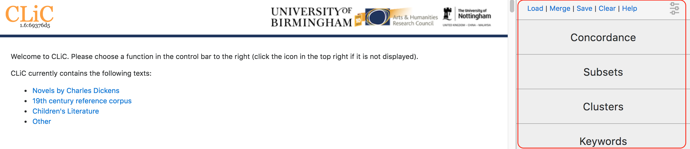

What's new in this version of CLiC
==================================

There have been several changes to the back-end; for further technical
details, please refer to our GitHub
repository\ `[3] <footnotes.html>`__. The focus of this user
guide is the CLiC interface\ `[4] <footnotes.html>`__,
which has changed substantially with version 1.6. The tabs for the
analysis functions **('Concordance', 'Subsets', 'Keywords',
'Clusters')** are now located on the side panel on the right (see
Figure). The sidebar menu can be toggled by
clicking on the menu icon in the top right corner in order to make more
space for the analysis screen.

   **Figure:** The CLiC home screen with the menu in the side panel on
   the right
