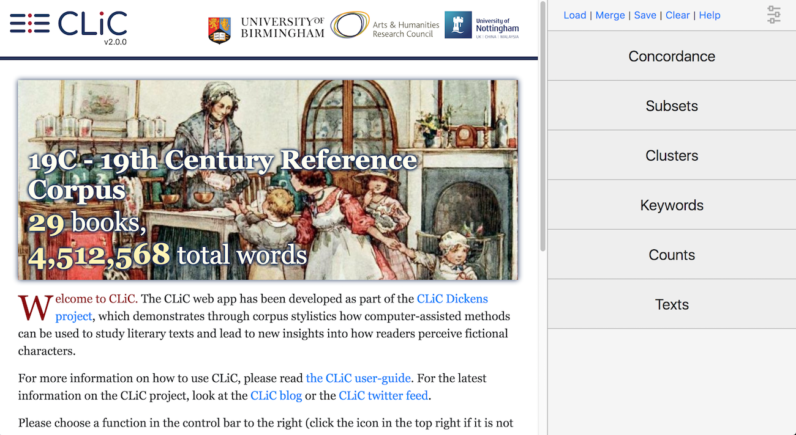

What's new in this version of CLiC
==================================

There have been major changes to the back-end as the underlying database infrastructure has been replaced. For further technical details of this replacement, please refer to the [GitHub_CLiC]_ repository. The focus of this user guide is the CLiC interface.  Due to the changes of the database, some of the basic functions of CLiC – like the concordance – will give slightly different results.

The main changes from previous versions to CLiC 2.0 that users should be aware of are:

* **New look**: 

The table of contents on the landing page has been replaced with a carousel of summary images for the corpora (see :numref:`figure-landing-page-2_0_0_19C`). An interactive overview of the corpora can now be found in the **Counts tab**.

.. _figure-landing-page-2_0_0_19C:

   The CLiC home screen with the menu in the side panel on
   the right

* Changes to the **tokenisation** (i.e. what CLiC recognises as a "word")

The tokenisation of texts has changed from CLiC 2.0. It is now based on based on unicode standard rules, used both for queries and importing books. By contrast to previous versions, the main changes include:

 1. Word forms ending in `'s` are now distinct types. So, a search for `mother` or `Oliver` will no longer include `mother's` or `Oliver's`.
 2. Any surrounding punctuation is filtered from types, thus searching for "connisseur" will return tokens "connisseur" and "_connisseur_".
 
Also see the explanation of the Concordance tab :ref:`Search the corpora`. More examples and the detailed technical documentation of the tokenizer is available from :mod:`clic.tokenizer`.

* **Searching all books by one author**

Across all tabs, the "search the corpora" field now allows you to select all books from a particular author at once, e.g. all 7 books by Jane Austen.

* **Concordances tab**

In concordances, short titles of books are now always visible and full titles can be seen hovering over the short title. Concordance queries now follow the new tokenisation rules (and searches for exact types, e.g. "Oliver" will no longer resturn "Oliver's") and accept wildcards (e.g. you can now query "Oliver*" to find both "Oliver" and "Oliver's"). Information on **relative frequencies** has been added to the output to simple concordances and to the new **distribution plot view**.
See the documentation of the Concordance tab for more details: :ref:`Concordance`.

* **Subset**: 

The new subset output shows percentage of text instead of relative frequency (unlike the concordance output). For example when displaying all quotes in book, the percentage indicates the proportion of the words in quotes.

* **Clusters**

The clusters search now ignores boundaries and only pays attention to token order. i.e. clusters can span adjacent quotes, but not chapters (as the title is in the way). You can also click on a cluster to retrieve a **matching concordance search**. If only one book is selected the frequency cutoff is 2.

In previous versions of CLiC there were minor discrepancies between concordance and cluster counts. In CLiC 2.0, these have been resolved.

* **Keywords tab**

The keyword output has been simplified (the expected target/ref columns have been removed). You can click on a keyword or key cluster to retrieve a **matching concordance search** and a new **swap button** will reverse the target and reference corpus options.

* **New Text tab**

The text tab shows full book contents (to replace the chapter-by-chapter selection on CLiC 1.6 landing page). This tab is designed to show one book at a time and allows you to navigate to particular chapters. You can select which levels of annotation to display on the text (e.g. Sentences, Quotes, Short suspensions, Long suspensions, Embedded quotes). The text can now be easily copied and pasted into Microsoft Word documents etc.

* **New Counts tab**

The Counts tab shows an interactive overview of the corpora, with word counts within corpora, books and subsets.
